# Insights

From *BEPH (BEiT-based model Pre-training on Histopathological image)* paper.

- **Preprocessing**
    - Tissue Segmentation - Otsu threshold on saturation channel: Apply this before cropping to eliminate blank areas in your crops.
    - Reject crops with too little tissue before training your classifier.
    - Local region sampling: For the regressor, random crops around the tissue -- Force crops around tumor mass (based on mask or regressor heatmap).
- Better **Feature Engineering** (PCA, UMAP) to inspect feature separability/detect overlap/decide on embedding: 
    - Apply PCA/UMAP to ConvNeXt features (penultimate layer): Extract the 768-dimensional feature vector (the output of the layer before your final classifier) for 1,000 random images. Run UMAP on these vectors.
        - If you see distinct clusters: Your model has learned well.
        - If classes are mixed: Your model is confused (or the features aren't strong enough).
        - If you see a small, isolated island: Those are likely your "Shrek" images or artifacts.
    - Verify if 4 classes are separable → If not:
        - Stronger augmentation
        - Better crop strategy
        - Pretrained pathology-specific encoder (e.g., CTransPath / UNI / BEPH encoder)
- **Architecture Recommendations**: ImageNet pretraining performs poorly in pathology tasks. ConvNeXt is good only if pretrained on pathology data, otherwise suboptimal. Better alternatives:
    - BEiT v2 (ImageNet → UNLABELED pathology patches)
    - CTransPath
    - UNI (2024)
    - CLAM backbones
- **Improved Augmentation**: Need to add histopathology-specific augmentations:
    - H&E **stain normalization**: Macenko / Reinhard normalization to reduce scanner variability.
    - Random color deconvolution
    - Gaussian blur / sharpen
    - Elastic deformation


## Other things to do:

- TA's advice

    | Component            | Old   | New               |
    | -------------------- | ----- | ----------------- |
    | Classifier Optimizer | AdamW | **Lion**          |
    | Regressor Optimizer  | Adam  | **Ranger**        |
    | LR Schedule          | None  | **Cosine LR**     |
    | LR                   | 1e-3  | **1e-4 (Lion)**   |
    | Reg LR               | 1e-3  | **3e-4 (Ranger)** |

- Maybe handle images with ink

---


# Shrek!! v2
{
    img_0005, img_0008, img_0022, img_0027, img_0036, img_0048, img_0062, img_0085, img_0095, img_0126, img_0129, img_0133, img_0136, img_0138, img_0148, img_0155, img_0159, img_0178, img_0179, img_0180, img_0187, img_0189, img_0193, img_0196, img_0251, img_0254, img_0263, img_0286, img_0313, img_0319, img_0344, img_0346, img_0371, img_0376, img_0390, img_0393, img_0410, img_0415, img_0424, img_0443, img_0459, img_0498, img_0499, img_0521, img_0540, img_0544, img_0547, img_0558, img_0565, img_0572, img_0586, img_0602, img_0607, img_0609, img_0614, img_0620, img_0623, img_0646, img_0658, img_0673
}

# Duplicated Goo
with goo
{
    img_0150, img_0020, img_0644, img_0639, img_0580, img_0052, img_0497, img_0161, img_0533, img_0656, img_0018, img_0578, img_0670, img_0175, img_0380, img_0078, img_0268, img_0293, img_0012, img_0530, img_0028, img_0355, img_0675, img_0090, img_0657, img_0094, img_0486, img_0531, img_0537, img_0453, img_0645, img_0001, img_0557, img_0222, img_0047, img_0184, img_0044, img_0567, img_0629, img_0407, img_0509, img_0342, img_0643, img_0130, img_0603, img_0368, img_0560, img_0333, img_0463, img_0635
}
clean
{
    img_0522, img_0381, img_0243, img_0568, img_0451, img_0302, img_0446, img_0640, img_0638, img_0554, img_0391, img_0269, img_0337, img_0154, img_0226, img_0168, img_xxxx, img_0686, img_0549, img_0526, img_0352, img_0166, img_0137, img_0131, img_0043, img_0033, img_0447, img_0454, img_0245, img_0387, img_0513, img_0201, img_0165, img_0325, img_0395, img_0478, img_0598, img_0087, img_0619, img_0655, img_0674, img_0548, img_0606, img_xxxx, img_0262, img_0324, img_0340, img_0279
}


---
---

# Further

- **Histopathology-Specific Augmentations**: Histology models perform very poorly without stain-specific augment. Add:
    - **H&E Stain Augmentation**: Simulates scanner differences + staining lab variability. Approach: Apply **Stain Jitter** on H&E deconvolution components:
        - Perturb hematoxylin channel scaling ±20%
        - Perturb eosin channel scaling ±20%
        - Recompose (You already have the H channel → you can extend to H&E using vectors.)
    
        Or (SOTA) use **StainMix/StainAug** used in PAIP2019, Camelyon16 winners.

    - **Elastic deformation (small intensity)**: Simulates realistic tissue warping. (Improve performance especially on Triple Negative)

    - **Gaussian noise & blur**
    - **Cutout / Random Erasing**: Simulates missing tissue regions, improves robustness.

- Too Few Patches per Image During Training: Right now training uses: 1 random 512×512 crop per epoch (per image). But WSIs have **high intra-image variation** → 1 crop is insufficient. 
    
    Solution: **Multiple random patches per image per epoch**. This dramatically increases effective dataset size.

- **Improve Patching Strategy** (currently random-only)

    Better solution: **Tissue-concentration sampling** - Use tissue mask (Otsu) to guide crops:
    * Compute tissue density in each patch
    * Reject patches with <30% tissue
    * Prefer patches containing nuclei cluster (use H-channel intensity)
    
- Add **Mixup + CutMix** (very effective with label smoothing)

    ```python
    if random.random() < 0.5:
        img, label = mixup(img1, img2, label1, label2, alpha=0.4)
    ```

    Mixing patches forces model to learn stain-invariant, morphology-level features.


- Use **Attention Pooling** Instead of Averaging. Averaging all tile probabilities is simplistic, biased by background tiles and doesn’t learn spatial importance. Better:
    - Top-K pooling
    - Softmax-weighted pooling: Use attention weights ~ exp(confidence).
    - MIL pooling (Deep MIL / ABMIL pooling)

- The Backbone Is Still ImageNet — Add a Simple Upgrade. Here are simple swaps compatible with Kaggle:
    - ConvNeXt-Small
    - ViT-Base
    - Swin-Tiny

    **Swin + H-channel (4 input channels) usually beats ConvNeXt**.

- Fix This: Validation Does NOT Use Patching — It Uses a Resize

    During validation:

        ```python
        patch = cv2.resize(full_img_np, (Config.IMG_SIZE_CLS, Config.IMG_SIZE_CLS))
        ```
    This is a major mismatch: Training uses **high-res patches** (512), Validation uses **one global resized image**. Thus, validation F1 is artificially low, early stopping triggers too early, model never sees its true inference behavior.

    **Fix:** For validation, also use **tiled inference** (but fewer tiles): stride = 512 (no overlap), at most 4 tiles, average predictions

### Recommendation:

**Fix validation + improve augment + add tissue-guided multi-patching** before touching the backbone.
These three steps solve 80% of your issues.


---
---


# Paper
*Detection of HER2 from Haematoxylin-Eosin Slides
Through a Cascade of Deep Learning Classifiers via
Multi-Instance Learning*

1. Divide slide into tiles (512×512) — “divide et impera” strategy.
2. Filter uninformative tiles (background or non-cancer).
3. Run tile-level classifier → produce per-tile HER2 probability.
4. Aggregate tile-level probabilities → slide-level decision using:
    - Mean probability
    - Mean of confident tiles
    - Fraction of tiles above threshold
    - Tabular fusion of tile distribution features
5. Final HER2 slide classification.

- Top-K Pooling
- Feature-Based Aggregation -- XGBoost

---
---

# Even further

- Replace Random Patch Selection With ROI-Driven Patch Extraction:

    Random guided cropping is not enough. You must ensure **only diagnostic tissue** enters the pipeline.

    Solution: 
    - Implement “Largest Connected Tissue Component” patching
        * Generate a tissue mask with Otsu + morphology (you already do this)
        * Only extract patches from the largest tissue region
        * Sample patches near *mask edges* + *mask center* (mimics pathologist behavior)

- Switch from Average Pooling/Top-K to **Attention-Based MIL Aggregation**

    Your pipeline becomes:

    ```
    Patch → CNN → 1024-d embedding → Attention MIL → Slide prediction
    ```

    Use the famous paper:

    📄 “Attention-based Deep Multiple Instance Learning” — Ilse et al., 2018

- Use **DINOv2 ViT-Small** or **Uni** Features (Self-Supervised): This is HUGE in H&E tasks.
    * ImageNet models fail on microscopic texture.
    * Histopathology ≈ texture classification, not object recognition.
    - Self-supervised ViTs are texture monsters.

- Reintroduce a Cleaner 4th Channel

    Switch to: **Reinhard Stain Normalization + Optical Density**
    - Simpler, stable, consistent.
    - Add as:

        ```
        Channel 4 = OD intensity map
        ```
    - This gives the model:
        * Nuclear density
        * Tissue contrast
        * Clean channel invariant to scanner color variation

- Use 3-stage Training Schedule
    - **Stage 1: Freeze backbone → train head** (You already do this)
    - **Stage 2: Unfreeze last 50% of backbone**
    - **Stage 3: Full fine-tuning with very low LR** (LR = 1e-6 or 5e-7) This is important for ViTs and ConvNeXt.

- Increase Tile Diversity per Slide

    Current: 4 patches
    Better: 16 patches (but smaller batch size)

    Use patch sizes:
    * 256
    * 384
    * 512

- Ensembling Multiple Backbones in Feature Space

    Since MIL is downstream, you can simply:

    ```
    Embedding = concat([ConvNeXt, ResNet50, ViT-small])
    → feed into MIL attention head
    ```

- Post-Training LightGBM Stack

    So final pipeline can be:

    ```
    Patch → CNN → 1024-d → mean+max+variance → LightGBM → slide label
    ```

---
---

# Trying
- No Regression, std: 

    F1 val = 0.4057
    
    LB F1 = 0.2667
- Feature-based Aggregation (LightGBM) - ConvNeXt-Tiny: 

    Overall OOF F1 = 0.4057  ||  Tabular CV Avg F1 = 0.6794  || **LB F1 = 0.3485**

    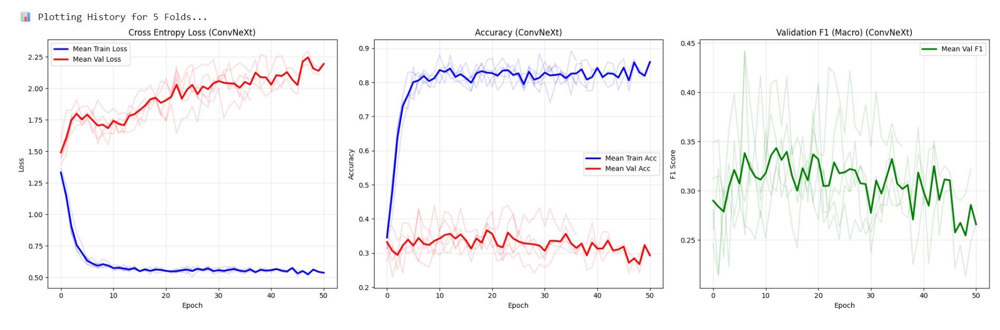 
    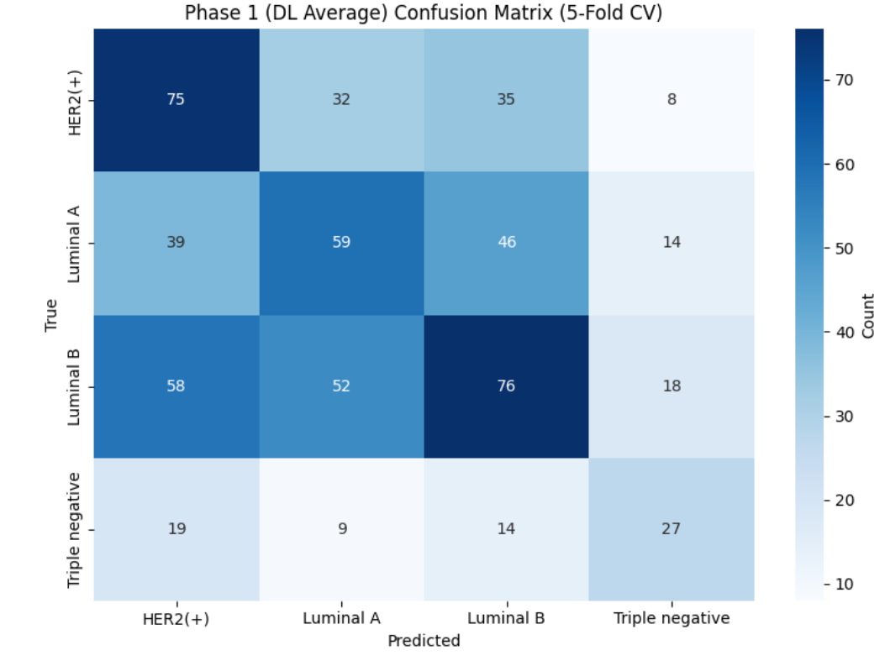 
    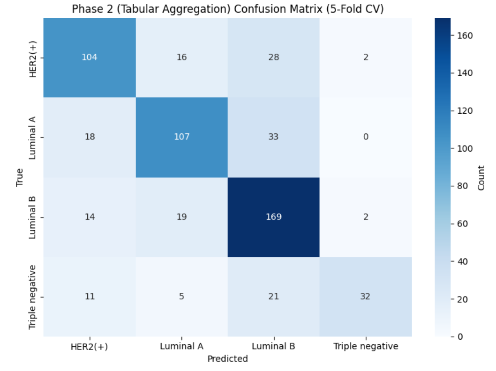

- No-TIFF: 

    F1 val = 0.3729

    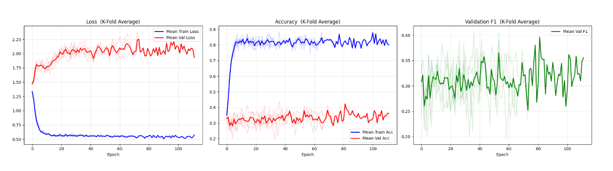
    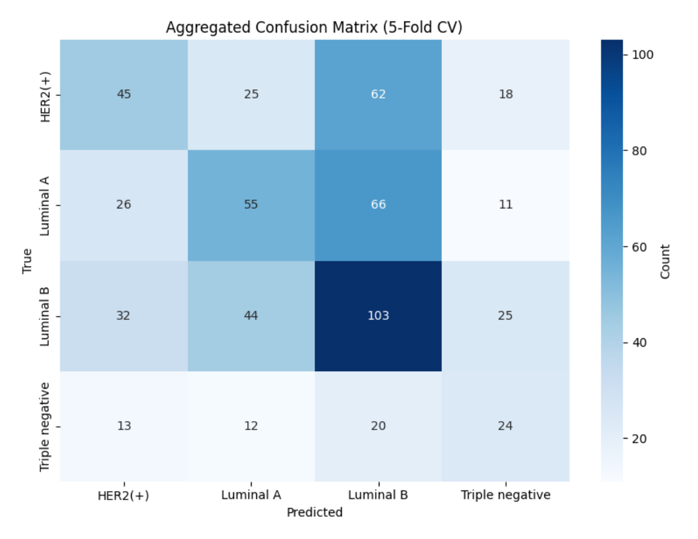

    LB F1 = 0.2739
- No-TIFF, Other models than ConvNeXt-Tiny:
    - EfficientNetV2-S
        
        F1 val = ...
    - ResNet50

        F1 val =
    - RegNetY-16GF

        F1 val =
    - ViT-B/16 Transformer

        F1 val =
- Robust Aggregation:
    - ConvNeXt-Tiny

        OOF F1 = 0.3980

        Robust CV Avg F1 = 0.7853

        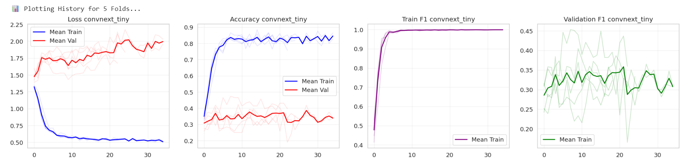
        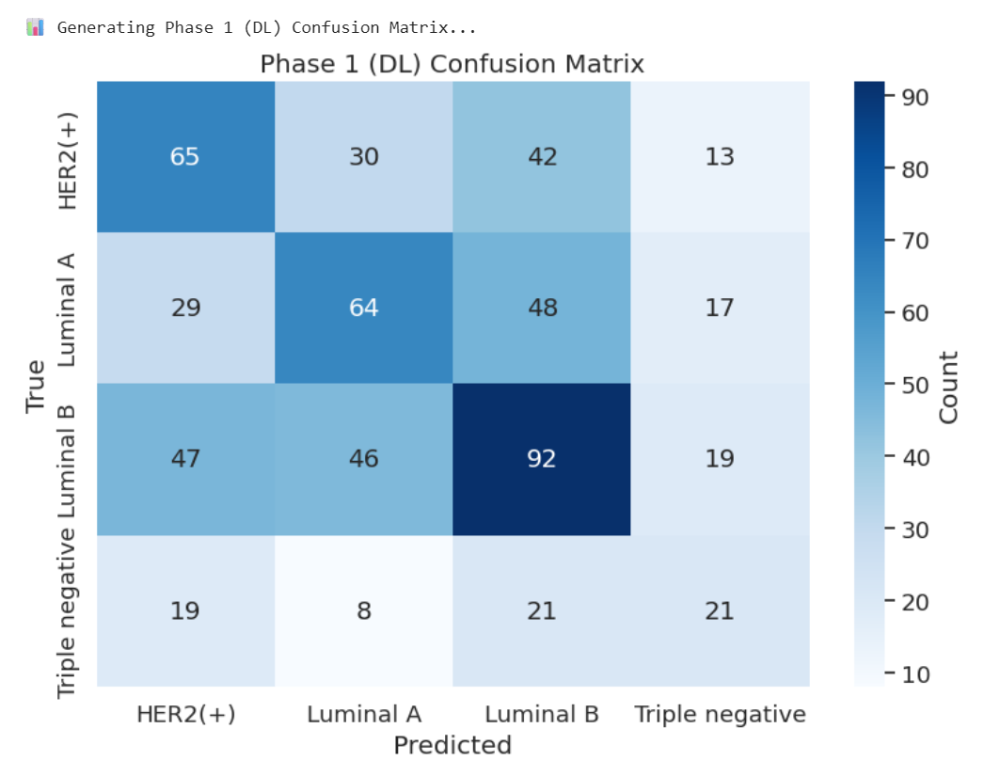
        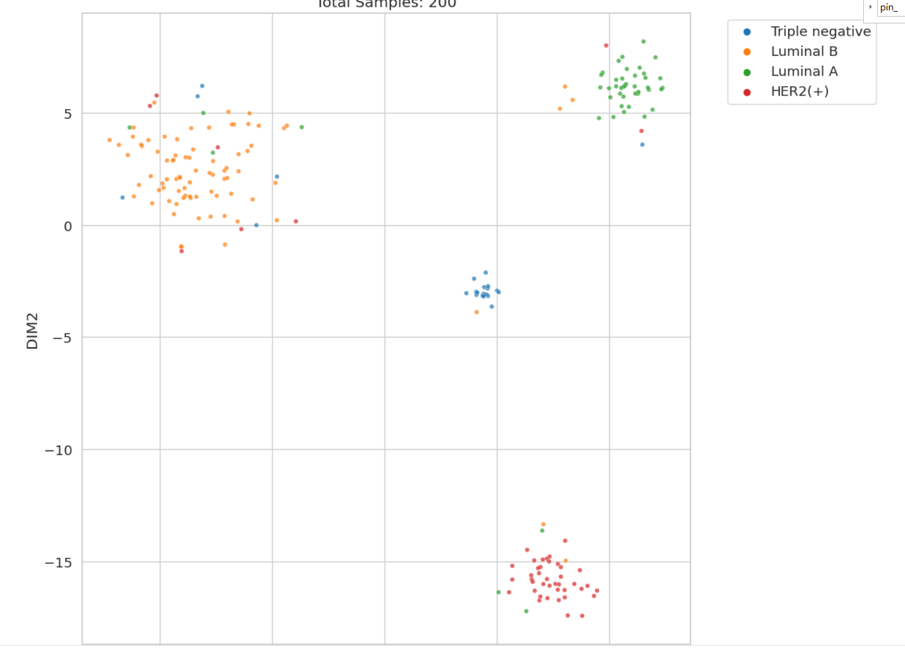
        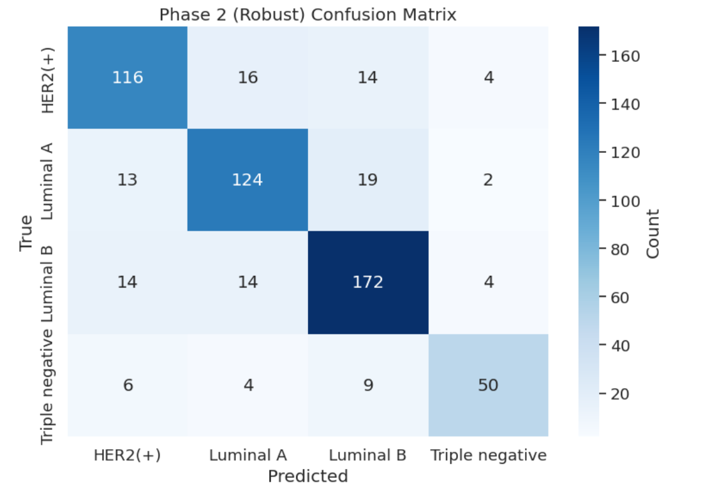

        LB F1 = 0.3135
    - ResNet50

        OOF F1 = 0.3878

        Robust CV Avg F1: 0.6133

        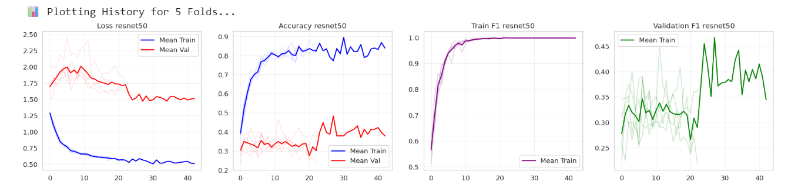
        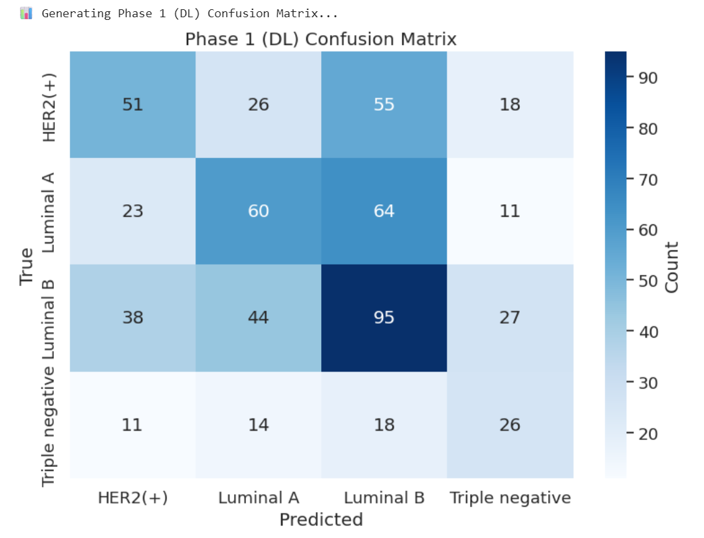
        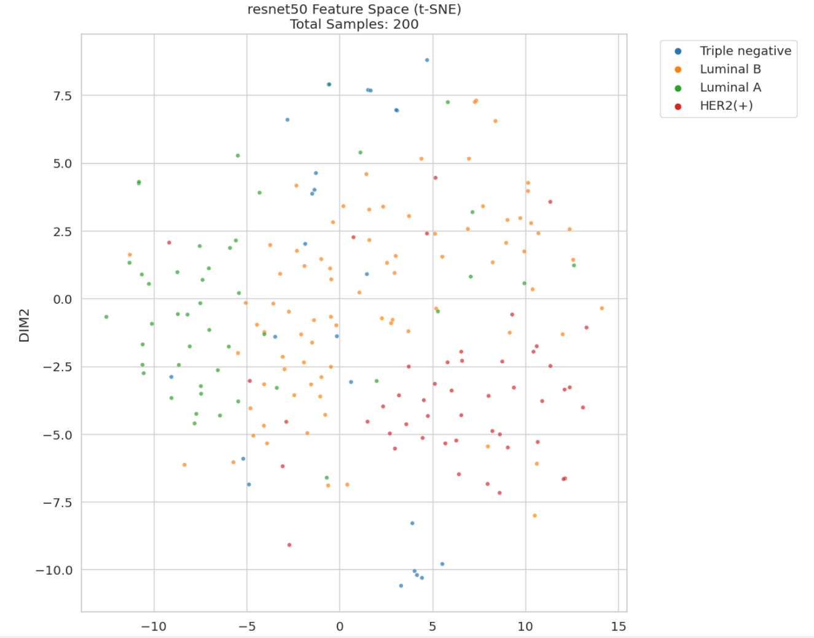
        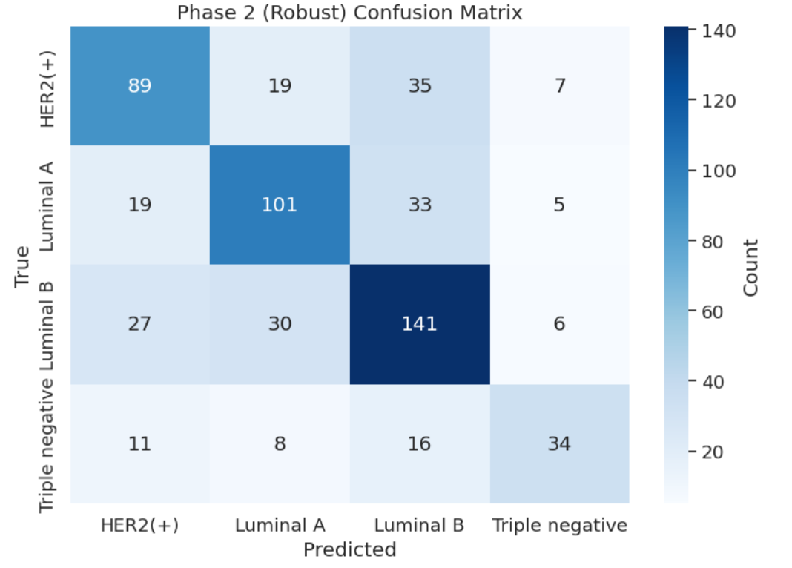

        LB F1 = 0.3143
    - EfficientNetV2-S

        F1 val =


- AB-MIL + ConvNeXt-Tiny:

    F1 val = 